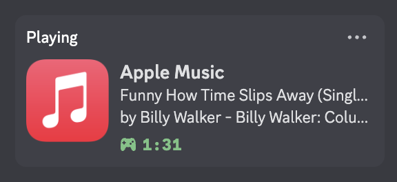

# Apple Music Presence
## A fairly rough implementation of displaying Apple Music status on your Discord activity for Mac,
## **NOTICE:** This is an unofficial tool and is not affiliated with Discord or Apple.
Your use of this program is **at your own risk**. Be aware that bugs may exist that could potentially lead to issues including, but not limited to, data loss or account suspension.

### Overview
This method uses **Discord Social SDK** and **Swift** to achieve, where the former focus on the communication between songs' metadata and Discord, the latter focus on receiving data from Apple Music.

The data communication is done by local network connection. The Swift program acts as a Server, and the C++ program acts as a Client.

### Features
Actually there's no great features. This only supports:
* Display "Playing Apple Music"
* Shows Title, Album, Artist
* Run on local



### How to Run?
You can either:
1. Directly execute run.sh in Terminal, which runs AppleMusicPresence and NowPlayingServer. Control + C to terminate the process.
2. Or review the code (which is like spaghetti. Sorry) and compile it by yourself. To compile, you will need
* C++ and Swift supports

* CMake: Used to build the C++ client.

* Discord: The Discord desktop application must be running.

Below operations can be done in Terminal.

To Compile C++ program, firstly make sure you are inside the main folder, and excute commands below:
```
mkdir build && cd build
cmake ..
cmake --build .
```
Remember to move the new AppleMusicPresence to main folder.

To Compile Swift program, you can go ack to main folder and simply run:
```
swiftc DataGrabbing.swift -o NowPlayingServer
```
Now you have two executables. You can either run those by your own script or run.sh.

### Known Issues
* Permissions: I use default for this program, which will be able to access friends info, rich presence, etc.. However, the program only access rich presence in order to update your activity status. No other modifications are made.
Also, the program will ask for permissions everytime you run the program. This probably could be solved by updating tokens.

* Startup: When you run the program while listening on Apple Music, the activity won't be properly updated due to NowPlayingServer only send data when there's an update of status (There might be a workaround). To solve this, you can simply pause and play music again to update.
  
* Display: I can't change the cover and use "Listening" instead of "Playing".

### Additional Infos
You can use your own app by changing APPLICATION_ID in main.cpp and make some adjustments. Please refer https://discord.com/developers/docs/discord-social-sdk/getting-started/using-c++

The program will automatically terminate itself after 5 minutes idle (Not listening to music). You can adjust it in main.cpp.
